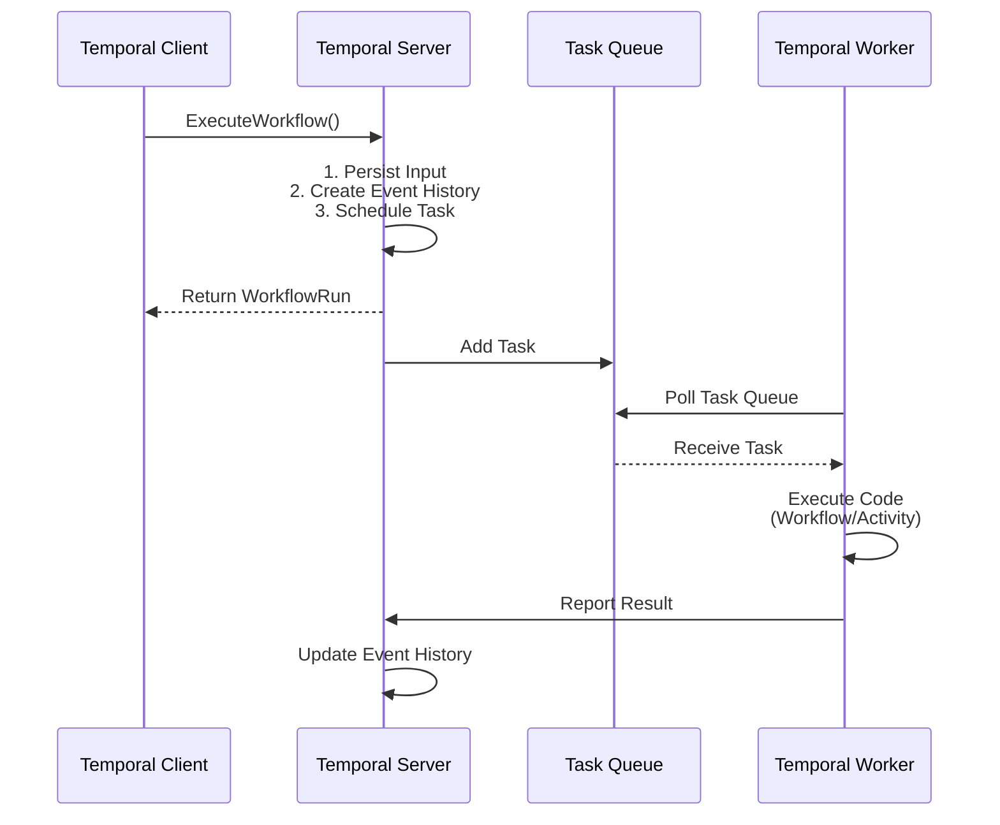
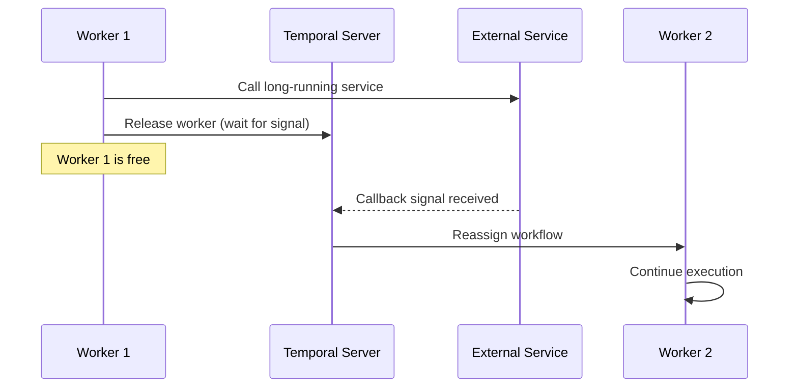

<style>
.slidev-layout {
  background: linear-gradient(-45deg,rgb(37, 51, 37), #EAEAEA);
  background-size: 400% 400%;
}
</style>


# Temporal Introduction

A Durable Execution Platform that help orchestrate microservice
<div class="pt-12">
  <span @click="$slidev.nav.next" class="px-2 py-1 rounded cursor-pointer " hover="bg-white bg-opacity-10">
    Press Space to continue <carbon:arrow-right class="inline"/>
  </span>
</div>

<div class="abs-tl m-6">
  <a href="https://tomlord.fyi" target="_blank" title="Visit my website">
    
  </a>
</div>

<div class="abs-bl m-6">
  <a href="https://tomlord.fyi" target="_blank" title="Visit my website">
    
  </a>
</div>

<div class="abs-br m-6 flex gap-2 items-center">
  <a href="https://github.com/Tomlord1122" target="_blank" alt="GitHub" title="Open in GitHub"
    class="text-xl slidev-icon-btn opacity-50 !border-none !hover:text-white">
    <carbon-logo-github />
  </a>
</div>

<!--
Hi 大家好，那我今天要sharing 的主題是 Temporal ，他是一個 open source 的 project 來幫助我們管理 microservice 之間的呼叫以及執行，確保我們的程式會順利的被執行完成。
-->

---

## Outline

<br/>

- #### **Background**
  - Close Loop Flow Service Introduction
  - Design Consideration
- #### **Temporal Introduction** 
  - Architecture Overview
  - Temporal Workflow
  - Temporal Activity
- #### **Demo**
- #### **Conclusion**

<!--
這是今天 Sharing 的 outline，首先是 Background，我會先介紹一下 Close Loop Flow Service 這個 project 在做什麼，接著是他的 Design Consideration，現在遇到的問題是什麼。

接下來就是 Temporal 的 Introduction，最後是 Demo 以及 Conclusion。來評估這個 tool 適不適合整合到 flow service 裡面。
-->

---
layout: image-right
image: /flow-service.png
backgroundSize: cover
---

##  Close Loop Flow Service

<div v-click="1" class="mb-3 mt-3">

- The core service of the Email Close Loop project, an **orchestration microservice** designed to coordinate and streamline complex submission case workflows **across multiple backend services**:
  
</div>

<div v-click="2">

  1. **Email Scan Service**
  2. **LLM Confidence Analyzer Service**
  3. **LLM Reasoning Analyzer Service**
  4. **Remediation Service**
  5. **Solve Service**
  6. **Custom Rule**
  7. **Whitelist Provider**
  8. **DB Manager Service**

</div>

<!--
首先，Close Loop 的目標是把product 那邊所提交的 fn, fp 的 eamil 做成一個完整閉環，那這個閉環是什麼意思？我們會對這些email 用公司 pattern 做 rescan 、用 LLM 做分析、最後生出一個補救的方案或是一 whitelist，最後把結果寫回 database 並回給 product 端做呈現，在這個過程中也會提供一些資訊讓來後續優化 email 的 pattern，像是 riskAI 那些的。

那剛剛提到的這些 action，其實都是 api call，而且分佈到各種不同的 microservice。也就是右邊藍色的部分。

那 flow service 是整個 close loop project 裡面很核心的 service 之一，我們會透過 flow service ，去協調編排其他不同的 microservice 來達成 close loop 的目的。
-->

---
layout: image-right
image: /fn-flow.png
backgroundSize: contain
---

## Design Consideration


Flow Service handles two types of cases

1. FN Case
2. FP Case

<div v-click="1">

Our requirements:
1. **Robust error handling**
2. **Retry mechanisms**
3. **Flow-state management**
4. **Observability & visibility**
5. **Easy to develop**
6. **Reduce maintenance overhead**

</div>

<div v-click="2">

<span v-mark.underline.red="2">Which tool can satisfy our requirements?</span>

</div>

<!--
這邊以 fn 的 case 為例，右邊的圖就是 fn 會走的 flow，紅色的部分就是那些 api call，並且在每一個 api call 執行時，我們會把這個 case 的狀態同步更新到 db 裡面，來記錄說現在的 case 執行到哪裡了。

理論上如果所有 service 都正常運作的話，那這個 flow 看起來就很完美，但現實是，如果遇到某個 service 掛掉了，我們要想辦法處理它，也就是 error handling 以及 retry 的機制，這部分目前的 flow service 是還沒有一個很好的實作方案，因為這些 api call 都是跨 service 的，所以開發上會比較麻煩一點。

因此這邊也就是要進入今天的主題，有沒有什麼 tool 可以拿來使用，滿足我們的這些需求：

好的 retry 跟 error handling 的機制，幫助我們管理 flow state，有好的觀測性，重要的還有 好開發，以及後續好維護。
-->

---

<div>

## Temporal Intro

Temporal is an <span class="text-red-600">**open-source durable execution platform**</span> originally created by former Uber engineers. It solves the complexity of building reliable distributed systems by providing:

- **Automatic state management**: Your <span v-mark.highlight.yellow>workflow state is automatically persited</span>
- **Failure recover**: <span v-mark.highlight.yellow>Automatic retries</span> and easy to recovery from failures
- **Long-running workflows**: Workflows can run for <span v-mark.highlight.yellow>hours, days, or even months</span>.
- **Visibility**: <span v-mark.highlight.yellow>Built-in observability</span> into workflow execution

<div v-click class="flex justify-between">

</div>
</div>

<!--
那來到今天的主角 Temporal，Temporal 是一個 open source project，由一群前 Uber 工程師開發的，他主打的是他提供一個 execution platform 來確保我們的程式能執行成功，開發者不用花太多心力擔心service 掛掉後怎麼辦。

所以他提供的功能有哪些呢
1. 自動化的去儲存每個 workflow 的狀態。
2. 當 failure 發生的時候，會透過他們存的狀態自動化的去 retry
3. 他支援長達幾個小時甚至幾個月長的 workflow
4. 他內建支援的 UI 能讓大家可以觀測說每個 workflow 執行的狀況。

那他是怎麼做到的呢？
-->

---

<div>

## Architecture Overview (1/2)

Temporal High-Level Architecture <code v-click>go get go.temporal.io/sdk</code>
<div class="flex justify-center items-center">

</div>
</div>

<!--
這個是 Temporal 的 High-Level Architecture，我們先看右邊的這個 Temporal Cluster，其實 Temporal 整個概念就是我們使用一個很大的 service 統一管理 Workflow 的狀態。

細部來看就是
1. History Service 來管理的Workflow Event log 儲存到 Temporal database，用來後續支援 retry 還有 recover
2. Matching Service 是將 註冊到 Temporal 的 Workflow 分發給 Worker 去執行，這邊要稍微提一下 Temporal 的 database 除了存 workflow state 以外還充當了 task queue 的角色。
3. Worker service 是 Temporal 內部的 Worker 專門執行 Temporal cluster 需要的 background task

那再開發上，我們只需要在我們的 application 那邊實作 Temporal Client 就能跟 Temporal Cluster 溝通了。

這邊要注意的是， Temporal Cluster 本身不會是實際執行我們的 Workflow，他只是負責管理紀錄現在有哪些 Workflow 還沒跑，他的狀態在哪，真的執行 code 的是我們在 Application 這邊定義好的 Temporal Worker

Temporal Worker 會不斷地去 polling Temporal Cluster 現在有沒有要執行的 workflow，抓下來執行。

另外 Temporal 有支援 GO SDK 可以幫助我們在 code 的層面做開發，都在 go 的 code 裡寫好這些 workflow 定義。
-->

---

## Architecture Overview (2/2)

Execution flow

<div class="flex justify-center items-center w-full h-full">
<div class="bg-white p-1 rounded-lg scale-150 mb-20">



</div>
</div>

<!--
那整個 execution flow 就像下面這張圖呈現。
-->

---

## Execution Example (Event History)

<div class="relative w-full h-full">
  
  
  
  
  
  
  
  
  
  
  
  
  
  
</div>

<!--
這邊是 Temporal 官方的 example，我們可以看主要的幾個 function 就好，右邊的則是視覺化的呈現每個 function 會怎麼影響到 Temporal Cluster
-->

---

## Temporal Workflow

A **Workflow** is a durable function that orchestrates **Activities**. Think of it as your business logic coordinator.

1. Must be deterministic (same inputs = same outputs)
2. Automatically retried on failure
3. State is preserved across crashes

<div class="flex justify-between items-center gap-2">

<div v-click>

```go
// Workflow Definition
func ExampleWorkflow(ctx workflow.Context, input Input) (string, error) {
    // It coordinates Activities but doesn't do the actual work
}

```
</div>

</div>

<!--
Temporal 裡面有一些專有名詞，了解這些才能順利地使用 Temporal。第一個是 Temporal Workflow

Temporal Workflow 就是一個定義流程的 function，負責編排多個要執行的 action。以 code 的層面就只是一個 function，在 Workflow 失敗時也會自動重試，並且把狀態存起來，右邊是 Workflow 可能執行流程。

這邊值得注意的是，為了支援 replay 以及 retry的功能，這邊 Temporal 會要求在定義 Workflow logic 的時候必須是 deterministic，也就是同樣的 input 搭配上被記錄到 Temporal Server 的 event history 資料，必須做出一樣的判斷。

所以我們要把裡面每次會回傳不一樣結果的 action 包裝成 Temporal Acitvity，這樣子在 replay 的時候 Temporal 遇到 Activity function時，會優先去 server 讀上次紀錄好的結果，而不會真的call 一次外部的 api。
-->

---

## Temporal Activity

An **Activity** is **a single, well-defined action** (like **calling an API**, database operation, or sending an email). In our case, Temporal Activity should be lots of close-loop microservice call.
<div class="flex gap-4">
<div class="w-1/2">
<div class="flex flex-col">
<span>1. Can be non-deterministic</span>
<span>2. Execute actual business logic</span>
<span>3. Can be retried independetly</span>
</div >
<span v-click>

```go
func (a *exampleActivity) Activity1(ctx context.Context, input Input) (string, error){
  // Actual business logic here
  // Can call external APIs, databases, etc
}
```
</span>
</div >

</div>

<!--
所以 Temporal Acitity 就是我們要執行的 action，像是 api call 之類的，在 code 的層面也是一個 function，在失敗時也會自動 retry。

所以我們可以理解為，整個 Temporal 的 retry 機制有分爲 Workflow-level 的 retry 還有 activity level 的 retry，這邊都可以透過 Go SDK 裡面快速地設定。
-->

---

## Temporal Code Example

````md magic-move
```go {1-4|6-19|all}

// Workflow Definition
func ExampleWorkflow(ctx workflow.Context, input Input) (string, error) {
    // It coordinates Activities but doesn't do the actual work
}

// Activity Definition (1, 2, 3)
func (a *exampleActivity) Activity1(ctx context.Context, input Input) (string, error){
  // Actual business logic here
  // Can call external APIs, databases, etc
}

func (a *exampleActivity) Activity2(ctx context.Context, input Input) (string, error){
  // Do something
}

func (a *exampleActivity) Activity3(ctx context.Context, input Input) (string, error){
  // Do something
}

```

```go

func ExampleWorkflow(ctx workflow.Context, input Input) (string, error) {
    // It coordinates Activities but doesn't do the actual work
    err := workflow.ExecuteActivity(ctx, Activity1, Input).Get(ctx, &activity1Result)
    if err != nil{
      // Do something
    }
    err := workflow.ExecuteActivity(ctx, Activity2, Input).Get(ctx, &activity2Result)
    if err != nil{
      // Do something
    }
    err := workflow.ExecuteActivity(ctx, Activity3, Input).Get(ctx, &activity3Result)
    if err != nil{
      // Do something
    }
    return "sucess", nil
}

```

```go

func ExampleWorkflow(ctx workflow.Context, input Input) (string, error) {
    // It coordinates Activities but doesn't do the actual work
    // Configure activity options with retry policy
    activityOptions := workflow.ActivityOptions{
      StartToCloseTimeout: 30 * time.Second,
      RetryPolicy: &temporal.RetryPolicy{
        InitialInterval:        time.Second,     // Start with 1s delay
        BackoffCoefficient:     2.0,             // Double the interval each time
        MaximumInterval:        5 * time.Second, // Cap at 5s between retries
        MaximumAttempts:        4,
        NonRetryableErrorTypes: []string{
          // Add non-retryable error types here if needed
        },
      },
    }

    ctx = workflow.WithActivityOptions(ctx, activityOptions)

    err := workflow.ExecuteActivity(ctx, Activity1, Input).Get(ctx, &activity1Result)
    if err != nil{
      // Do something
    }
    // remaining part...
}


```
````

<!--
這邊就是簡單的 Code Example

我們有一個 Workflow

以及三個 activity

在組裝起來後大概會長這樣子， Workflow 裡面會去呼叫 Activity，且每個 Acitivity 的狀態跟結果會存到 event history 裡面。

另外在 workflow 裡面可以個別設定說這個 activity (以我們的 use case 是 api call)  的 timeout 時間， retry 次數還有 backoff 的參數之類的。
-->

---

## Demo (AI-FP)

<div class="relative h-full w-full justify-center items-center">


</div>

<!--
接下來是 demo 的部分，讓大家看一下 flow service 如果使用 temporal 大概會長怎樣，這是原本的架構
ai-fp 這個 flow 目前會呼叫這兩個 service 並執行這些 function

改成 Temporal 的部分以後，flow service 實作了 temporal client，並且把 api call 包裝成 activity，這邊我們先用了 docker container 在本地端把 Temporal Cluster 跑起來。

（跳到code）
-->

---


## Temporal Advanced Pattern

<br/>

- **Long time service call:**  <span v-click>[Temporal Signal Pattern](https://docs.temporal.io/handling-messages)</span>
   
  <span v-click>Release the worker and wait for the callback signal</span>
  
  <span v-click>After receiving the signal, reassign the workflow to another worker.</span>

<div v-click class="flex justify-center items-center w-full">
<div class="bg-white rounded-lg scale-180 mt-15">



</div>
</div>

---


## Conclusion

<!-- <div class="text-xs">

| **Requirement** | Temporal | Argo Workflows | Airflow |
|-------------|:--------:|:--------------:|:-------:|
| Robust error handling | ✅ | ✅ | ✅ |
| Retry mechanisms | ✅ | ⚠️ | ⚠️ |
| Observability & visibility | ✅ | ✅ | ✅ |
| Event-driven | ✅ | ⚠️ | ⚠️ |
| Go support (SDK) | ✅ | ✅ | ⚠️ |

</div> -->


<div class="text-sm mt-4 opacity-100">

<!-- ✅ = Native support &nbsp;&nbsp; ⚠️ = Partial / requires custom implementation -->
<div v-click="1">With <span v-mark.highlight.yellow="2">a mature Go SDK</span> and an <span v-mark.highlight.yellow="2">architecture that aligns well with our codebase</span>, Temporal seems like a good choice.</div>

<span v-click="3">It solve our requirement:</span>

<div v-click="4">

1. Robust error handling
2. Auto Retry mechanism
3. Observability
4. Workflow state management
5. Easy to develop

</div>

<br/>
<div v-click="5">

Consideration: <span v-mark.underline.red="6">Deployment efforts</span>

<span v-click="7">[Temporal Helm Chart](https://github.com/temporalio/helm-charts)</span>

</div>

</div>
