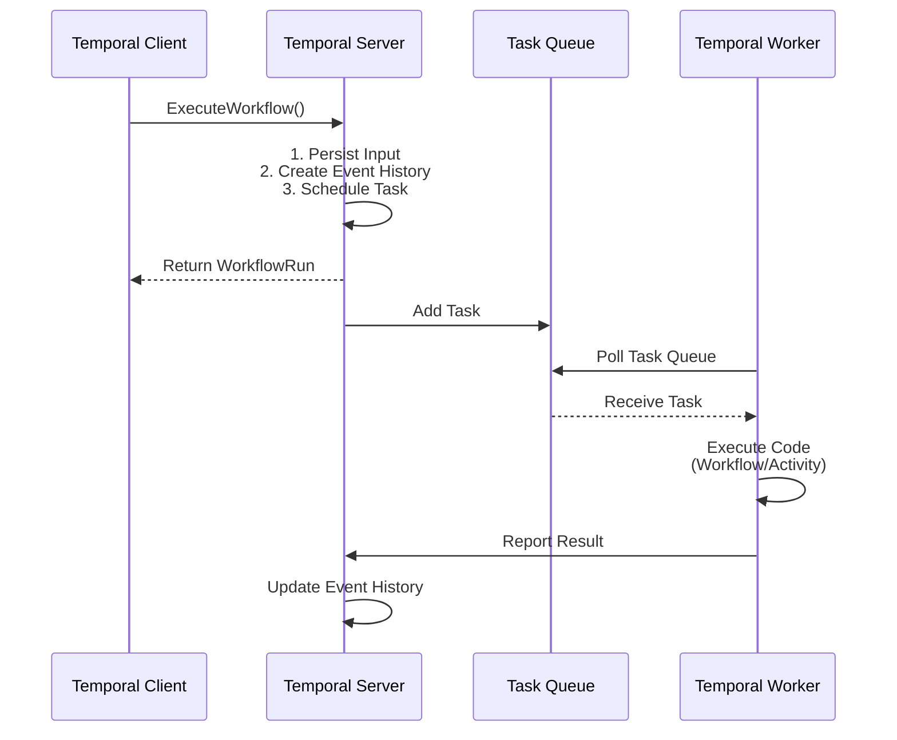
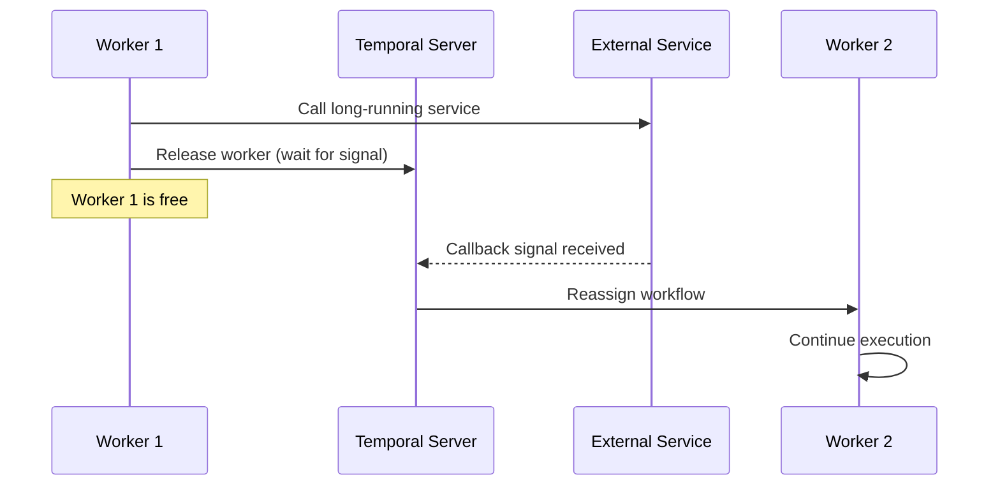

<style>
.slidev-layout {
  background: linear-gradient(-45deg,rgb(37, 51, 37), #EAEAEA);
  background-size: 400% 400%;
}
</style>


# Temporal Introduction

A Durable Execution Platform that help orchestrate microservice
<div class="pt-12">
  <span @click="$slidev.nav.next" class="px-2 py-1 rounded cursor-pointer " hover="bg-white bg-opacity-10">
    Press Space to continue <carbon:arrow-right class="inline"/>
  </span>
</div>

<div class="abs-tl m-6">
  <a href="https://tomlord.fyi" target="_blank" title="Visit my website">
    
  </a>
</div>

<div class="abs-bl m-6">
  <a href="https://tomlord.fyi" target="_blank" title="Visit my website">
    
  </a>
</div>

<div class="abs-br m-6 flex gap-2 items-center">
  <a href="https://github.com/Tomlord1122" target="_blank" alt="GitHub" title="Open in GitHub"
    class="text-xl slidev-icon-btn opacity-50 !border-none !hover:text-white">
    <carbon-logo-github />
  </a>
</div>

---

## Outline

<br/>

- #### **Background**
  - Close Loop Flow Service Introduction
  - Design Consideration
- #### **Temporal Introduction** 
  - Architecture Overview
  - Temporal Workflow
  - Temporal Activity
- #### **Demo**
- #### **Conclusion**

---
layout: image-right
image: /flow-service.png
backgroundSize: cover
---

##  Close Loop Flow Service

<div v-click="1" class="mb-3 mt-3">

- The core service of the Email Close Loop project, an **orchestration microservice** designed to coordinate and streamline complex submission case workflows **across multiple backend services**:
  
</div>

<div v-click="2">

  1. **Email Scan Service**
  2. **LLM Confidence Analyzer Service**
  3. **LLM Reasoning Analyzer Service**
  4. **Remediation Service**
  5. **Solve Service**
  6. **Custom Rule**
  7. **Whitelist Provider**
  8. **DB Manager Service**

</div>

---
layout: image-right
image: /fn-flow.png
backgroundSize: contain
---

## Design Consideration


Flow Service handles two types of cases

1. FN Case
2. FP Case

<div v-click="1">

Our requirements:
1. **Robust error handling**
2. **Retry mechanisms**
3. **Flow-state management**
4. **Observability & visibility**
5. **Easy to develop**
6. **Reduce maintenance overhead**

</div>

<div v-click="2">

<span v-mark.underline.red="2">Which tool can satisfy our requirements?</span>

</div>

---

<div>

## Temporal Intro

Temporal is an <span class="text-red-600">**open-source durable execution platform**</span> originally created by former Uber engineers. It solves the complexity of building reliable distributed systems by providing:

- **Automatic state management**: Your <span v-mark.highlight.yellow>workflow state is automatically persited</span>
- **Failure recover**: <span v-mark.highlight.yellow>Automatic retries</span> and easy to recovery from failures
- **Long-running workflows**: Workflows can run for <span v-mark.highlight.yellow>hours, days, or even months</span>.
- **Visibility**: <span v-mark.highlight.yellow>Built-in observability</span> into workflow execution

<div v-click class="flex justify-between">

</div>
</div>

---

<div>

## Architecture Overview (1/2)

Temporal High-Level Architecture <code v-click>go get go.temporal.io/sdk</code>
<div class="flex justify-center items-center">

</div>
</div>


---


## Architecture Overview (2/2)

Execution flow

<div class="flex justify-center items-center w-full h-full">
<div class="bg-white p-1 rounded-lg scale-150 mb-20">



</div>
</div>

---

## Execution Example (Event History)

<div class="relative w-full h-full">
  
  
  
  
  
  
  
  
  
  
  
  
  
  
</div>


---

## Temporal Workflow

A **Workflow** is a durable function that orchestrates **Activities**. Think of it as your business logic coordinator.

1. Must be deterministic (same inputs = same outputs)
2. Automatically retried on failure
3. State is preserved across crashes

<div class="flex justify-between items-center gap-2">

<div v-click>

```go
// Workflow Definition
func ExampleWorkflow(ctx workflow.Context, input Input) (string, error) {
    // It coordinates Activities but doesn't do the actual work
}

```
</div>

</div>

<!--
asdasdad
asdasd
-->

---

## Temporal Activity

An **Activity** is **a single, well-defined action** (like **calling an API**, database operation, or sending an email). In our case, Temporal Activity should be lots of close-loop microservice call.
<div class="flex gap-4">
<div class="w-1/2">
<div class="flex flex-col">
<span>1. Can be non-deterministic</span>
<span>2. Execute actual business logic</span>
<span>3. Can be retried independetly</span>
</div >
<span v-click>

```go
func (a *exampleActivity) Activity1(ctx context.Context, input Input) (string, error){
  // Actual business logic here
  // Can call external APIs, databases, etc
}
```
</span>
</div >

</div>


---

## Temporal Code Example

````md magic-move
```go {1-4|6-19|all}

// Workflow Definition
func ExampleWorkflow(ctx workflow.Context, input Input) (string, error) {
    // It coordinates Activities but doesn't do the actual work
}

// Activity Definition (1, 2, 3)
func (a *exampleActivity) Activity1(ctx context.Context, input Input) (string, error){
  // Actual business logic here
  // Can call external APIs, databases, etc
}

func (a *exampleActivity) Activity2(ctx context.Context, input Input) (string, error){
  // Do something
}

func (a *exampleActivity) Activity3(ctx context.Context, input Input) (string, error){
  // Do something
}

```

```go

func ExampleWorkflow(ctx workflow.Context, input Input) (string, error) {
    // It coordinates Activities but doesn't do the actual work
    err := workflow.ExecuteActivity(ctx, Activity1, Input).Get(ctx, &activity1Result)
    if err != nil{
      // Do something
    }
    err := workflow.ExecuteActivity(ctx, Activity2, Input).Get(ctx, &activity2Result)
    if err != nil{
      // Do something
    }
    err := workflow.ExecuteActivity(ctx, Activity3, Input).Get(ctx, &activity3Result)
    if err != nil{
      // Do something
    }
    return "sucess", nil
}

```

```go

func ExampleWorkflow(ctx workflow.Context, input Input) (string, error) {
    // It coordinates Activities but doesn't do the actual work
    // Configure activity options with retry policy
    activityOptions := workflow.ActivityOptions{
      StartToCloseTimeout: 30 * time.Second,
      RetryPolicy: &temporal.RetryPolicy{
        InitialInterval:        time.Second,     // Start with 1s delay
        BackoffCoefficient:     2.0,             // Double the interval each time
        MaximumInterval:        5 * time.Second, // Cap at 5s between retries
        MaximumAttempts:        4,
        NonRetryableErrorTypes: []string{
          // Add non-retryable error types here if needed
        },
      },
    }

    ctx = workflow.WithActivityOptions(ctx, activityOptions)

    err := workflow.ExecuteActivity(ctx, Activity1, Input).Get(ctx, &activity1Result)
    if err != nil{
      // Do something
    }
    // remaining part...
}


```
````

---

## Demo (AI-FP)

<div class="relative h-full w-full justify-center items-center">


</div>

---


## Temporal Advanced Pattern

<br/>

- **Long time service call:**  <span v-click>[Temporal Signal Pattern](https://docs.temporal.io/handling-messages)</span>
   
  <span v-click>Release the worker and wait for the callback signal</span>
  
  <span v-click>After receiving the signal, reassign the workflow to another worker.</span>

<div v-click class="flex justify-center items-center w-full">
<div class="bg-white rounded-lg scale-180 mt-15">



</div>
</div>

---


## Conclusion

<!-- <div class="text-xs">

| **Requirement** | Temporal | Argo Workflows | Airflow |
|-------------|:--------:|:--------------:|:-------:|
| Robust error handling | ✅ | ✅ | ✅ |
| Retry mechanisms | ✅ | ⚠️ | ⚠️ |
| Observability & visibility | ✅ | ✅ | ✅ |
| Event-driven | ✅ | ⚠️ | ⚠️ |
| Go support (SDK) | ✅ | ✅ | ⚠️ |

</div> -->


<div class="text-sm mt-4 opacity-100">

<!-- ✅ = Native support &nbsp;&nbsp; ⚠️ = Partial / requires custom implementation -->
<div v-click="1">With <span v-mark.highlight.yellow="2">a mature Go SDK</span> and an <span v-mark.highlight.yellow="2">architecture that aligns well with our codebase</span>, Temporal seems like a good choice.</div>

<span v-click="3">It solve our requirement:</span>

<div v-click="4">

1. Robust error handling
2. Auto Retry mechanism
3. Observability
4. Workflow state management
5. Easy to develop

</div>

</div>
